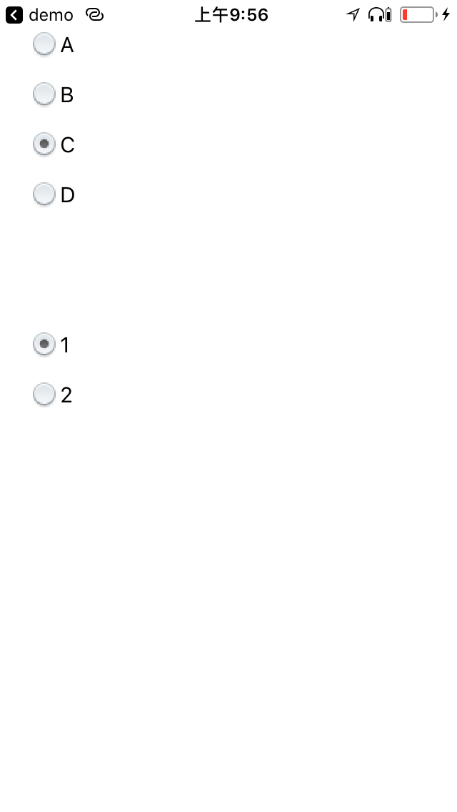

# IRRadioButton 

- IRRadioButton is a powerful radio button for iOS.

## Features
- Radio buttons

## Install
### Git
- Git clone this project.
- Copy this project into your own project.
- Add the .xcodeproj into you  project and link it as embed framework.
#### Options
- You can remove the `demo` and `ScreenShots` folder.

### Cocoapods
- Add `pod 'IRRadioButton'`  in the `Podfile`
- `pod install`

## Usage

### Basic

```obj-c
#import <IRRadioButton/IRRadioButton.h>

CGRect rect = CGRectMake(20, 20, 160, 25);
IRRadioButton *rb1 = [[IRRadioButton alloc] initWithFrame:rect groupId:@"group0" index:0];
[rb1 setText:@"A"];
[self.view addSubview:rb1];

rect = CGRectMake(20, 20 + 25 + 10, 160, 25);
IRRadioButton *rb2 = [[IRRadioButton alloc] initWithFrame:rect groupId:@"group0" index:1];
[rb2 setText:@"B"];
[self.view addSubview:rb2];

rect = CGRectMake(20, 20 + (25 + 10) * 2, 160, 25);
IRRadioButton *rb3 = [[IRRadioButton alloc] initWithFrame:rect groupId:@"group0" index:2];
[rb3 setText:@"C"];
[rb3 setSelected:YES];
[self.view addSubview:rb3];

rect = CGRectMake(20, 20 + (25 + 10) * 3, 160, 25);
IRRadioButton *rb4 = [[IRRadioButton alloc] initWithFrame:rect groupId:@"group0" index:3];
[rb4 setText:@"D"];
[self.view addSubview:rb4];


rect = CGRectMake(20, 20 + (25 + 10) * 6, 160, 25);
IRRadioButton *rb5 = [[IRRadioButton alloc] initWithFrame:rect groupId:@"group1" index:0];
[rb5 setText:@"1"];
[rb5 setSelected:YES];
[self.view addSubview:rb5];

rect = CGRectMake(20, 20 + (25 + 10) * 7, 160, 25);
IRRadioButton *rb6 = [[IRRadioButton alloc] initWithFrame:rect groupId:@"group1" index:1];
[rb6 setText:@"2"];
[self.view addSubview:rb6];

[IRRadioButton addObserver:self forGroupId:@"group0"];
[IRRadioButton addObserver:self forGroupId:@"group1"];
```

## Screenshots


## Copyright
##### This project is inspired from [RadioButton](https://github.com/laughmaker/RadioButton).

